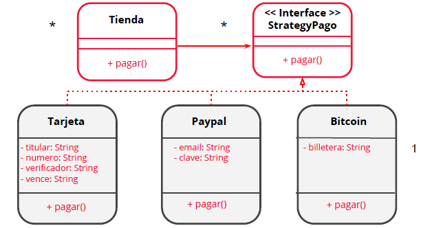

# Ejemplo
Supongamos que estamos diseñando una
tienda online y queremos que acepte distintos
medios de pago (tarjeta de crédito, Paypal,
Bitcoin, etc). Un ejemplo de arquitectura con
Strategy sería el siguiente.
#UML
