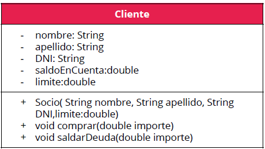

# Ejercicio

En un comercio donde los clientes poseen cuenta corriente, en el sistema se tiene diseñada
una clase cliente, los clientes tienen nombre, apellido y DNI, además un saldo que puede ser
deudor y un límite. Inicialmente se hace un estudio de la capacidad financiera del cliente y se
establece este límite.

Debemos crear Excepciones para utilizar con esta clase, el nombre de la clase que se nos
solicita es ClientesException.

La clase debe generar Excepciones, cuando el cliente intenta comprar y el saldo supere su
límite establecido o cuando intente pagar y no tenga deuda. Se adjunta el código de la clase
cliente.

