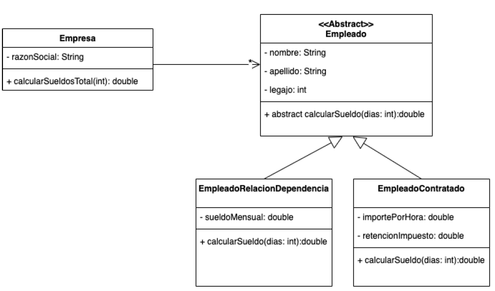
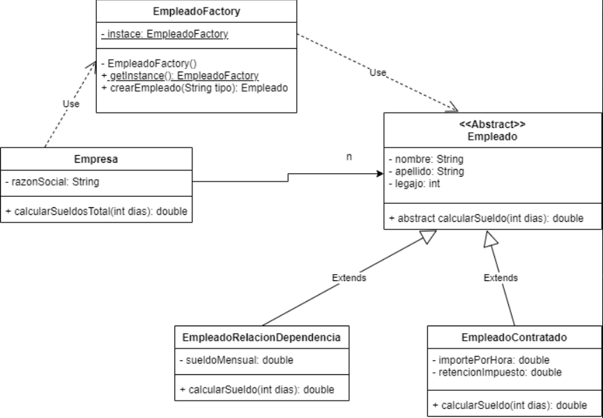

# Enunciado
Dada la siguiente familia de clases, se te encomienda el desafío de optimizar el diseño,
teniendo en cuenta que necesitamos construir objetos de estas clases a partir de
diferentes parámetros establecidos.

Si recibimos como parámetro “EMP-INT” deberás poder construir un objeto de la clase
EmpleadoRelacionDependencia y si el parámetro es “EMP-EXT” deberás poder construir un
objeto de la clase EmpleadoContratado.

Basado en el enunciado realizar:
a) Modificar el diagrama de clases con la implementación del Patrón Factory
b) La programación del método calcularSueldo que devuelva (no muestre por consola) el
sueldo para la cantidad de días que dicho método reciba como parámetro. Tener en
cuanta que en el caso de los empleados en relación de dependencia se deberá calcular el
proporcional a los días trabajados.
Consideraciones: Considerar que los meses tienen todos 30 días y trabajan 8 hs diarias.

