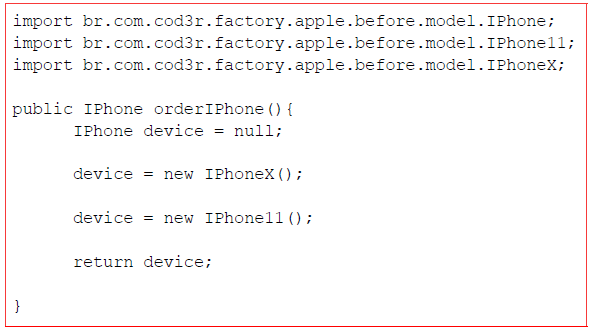

#Objetivo

En el siguiente código veremos un método para generar una solicitud desde un
iPhone, donde tenemos el uso de "new" para instanciar una nueva clase
concreta dentro de la variable "device". El objetivo es pasar el método siguiente
al patrón factory y mostrar cómo se verá el código.

