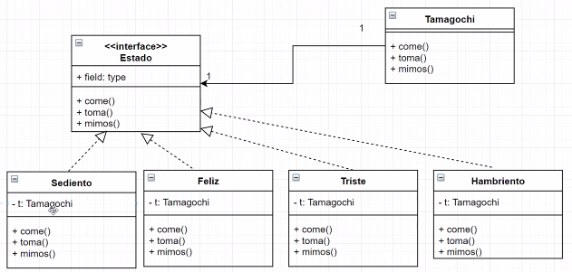

# Patron State: Ejercicio Tamagochi

Se desea modelar un Tamagotchi (mascota virtual), esta responde a cada uno de los
estímulos que se le aplican de diferente manera de acuerdo a como se encuentra en
ese momento.

Puede estar en alguno de los siguientes estados (solo uno a la vez):

1. Feliz
2. Triste
3. Hambriento
4. Sediento

Se le pueden dar los siguientes estímulos:
- Darle de beber
- Darle de comer
- Hacerle mimos

<table style="width: 100%; text-align: center;">
  <tr>
    <td style="width: 33%;">Estado actual</td>
    <td style="width: 33%;">Estímulo</td>
    <td style="width: 33%;">Efecto final</td>
  </tr>
  <tr>
    <td>Hambriento</td>
    <td>Se le da de comer</td>
    <td>Pasa a feliz</td>
  </tr>
  <tr>
    <td>Triste</td>
    <td>Se le da de comer</td>
    <td>Hace 2 beep y el display muestra a la mascota vomitando</td>
  </tr>
    <tr>
    <td>Sediento</td>
    <td>Se le da de comer</td>
    <td>Sin cambio alguno</td>
  </tr>
  <tr>
    <td>Feliz</td>
    <td>Se le da de comer</td>
    <td>Sin cambio alguno</td>
  </tr>
  <tr>
    <td>Sediento</td>
    <td>Se le da de tomar</td>
    <td>pasa a Feliz</td>
  </tr>
    <tr>
    <td>Feliz</td>
    <td>Se le da de tomar</td>
    <td>el artefacto hace 5 beep</td>
  </tr>
  <tr>
    <td>Triste</td>
    <td>Se le da de comer</td>
    <td>El artefacto hace 3 beep y titila el display</td>
  </tr>
  <tr>
    <td>Hambriento</td>
    <td>Se le da de tomar</td>
    <td>Sin cambio alguno</td>
  </tr>
  <tr>
    <td>Triste</td>
    <td>Se le hace un mimo</td>
    <td>Pasa a feliz</td>
  </tr>
  <tr>
    <td>Feliz</td>
    <td>Se le hace un mimo</td>
    <td>Sin cambio alguno</td>
  </tr>
  <tr>
    <td>Hambriento</td>
    <td>Se le hace un mimo</td>
    <td>Sin cambio alguno</td>
  </tr>
  <tr>
    <td>Sediento</td>
    <td>Se le hace un mimo</td>
    <td>Sin cambio alguno</td>
  </tr>
</table>

Y ahora???

Vamos a realizar el diagrama de clases y el código Java necesario para representar el
modelo enunciado sin tomar en cuenta lo que ocurre en el display ni los beeps.

