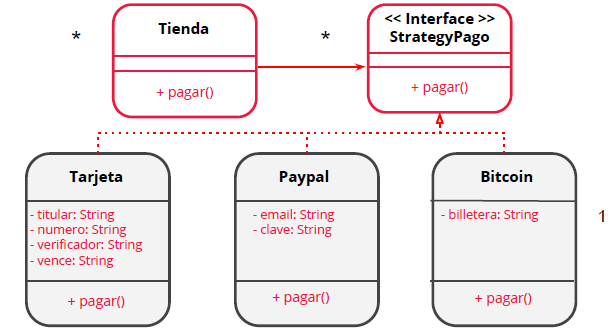

# Ejercicio

 Ahora sos un SuperChofer que va a conducir un vehículo.

Podrá ser cualquier vehículo: auto, camión, moto, lancha.

Cada vehículo, por sus características, tendrá la funcionalidad de acelerar y frenar de una forma diferente(*).

Por lo que nuestro SuperChofer, solo tendrá que preocuparse de acelerar y frenar, pudiendo cambiar de vehículo en cualquier momento.

A nuestro conductor tampoco le importará cómo es «por dentro» cada vehículo. Lo más importante para él es la posibilidad de cambiar de vehículo, y poder acelerar y frenar a su antojo.

(*) En la funcionalidad de acelerar y frenar simplemente indicar por consola un mensaje que diga, por ejemplo, “acelerando auto”, “frenando auto”, etc.

Pensá qué pasaría si ahora aparece un nuevo vehículo, ¿qué habría que modificar? 

# UML

