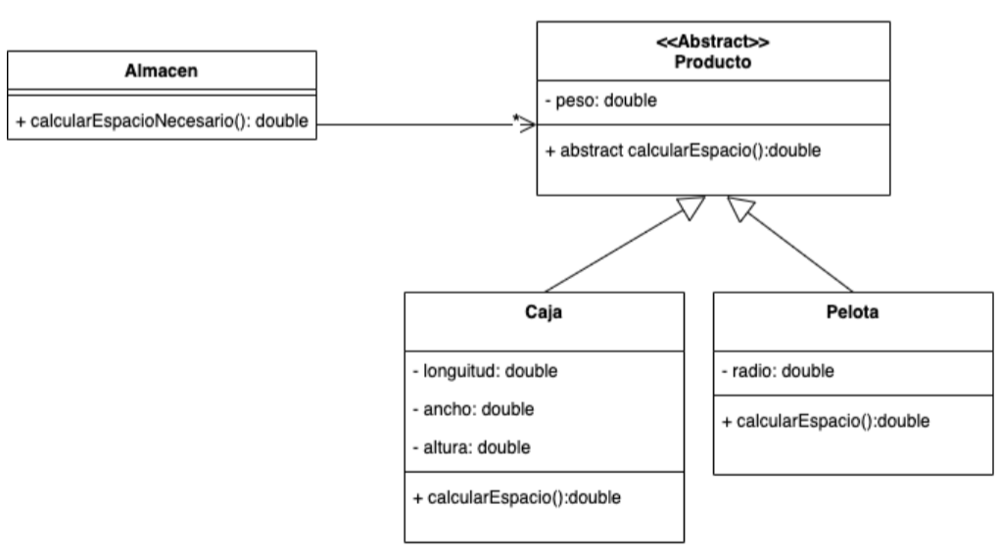
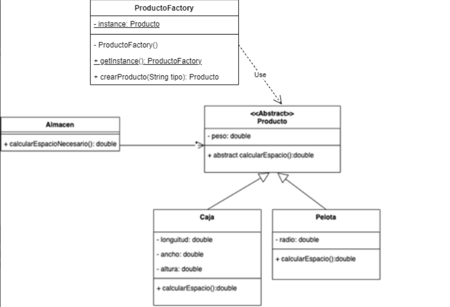

# Objetivo

Modelar y programar en Java la implementación del Patrón de Diseño Factory.

# Enunciado

Dada la siguiente familia de clases, se te encomienda el desafío de optimizar el diseño,
teniendo en cuenta que necesitamos construir objetos de estas clases a partir de
diferentes parámetros recibidos.

Si recibimos como parámetro “CAJA10X10” deberás poder construir un objeto de la clase
Caja que tenga una longitud, ancho y altura de 10 cm. Si el parámetro es “PELOTAFULTBOL”
deberás poder construir un objeto de la clase pelota cuyo radio sea de 11 cm, tamaño del radio de una pelota de fútbol. Si se recibe como parámetro
“PELOTATENIS” deberás construir un objeto pelota con un radio de 0,32 cm.

Con base en el enunciado:

A) Modificar el diagrama de clases con la implementación del Patrón Factory.

c) Realizar la programación del método calcularEspacio que devuelva (no muestre por
consola) la cantidad de espacio necesario que necesita cada producto, es decir, la
superficie que ocupa.

d) Realizar la programación del método calcularEspacioNecesario que devuelva la
cantidad de espacio necesario para guardar todos los productos del almacén.

Consideraciones: contemplar todas las medidas en cm.

