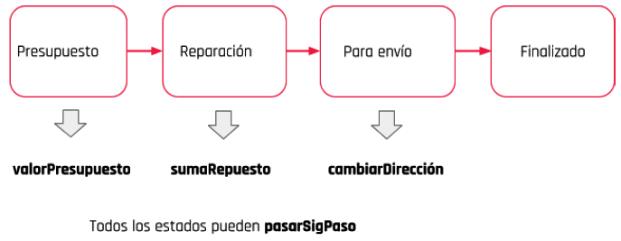
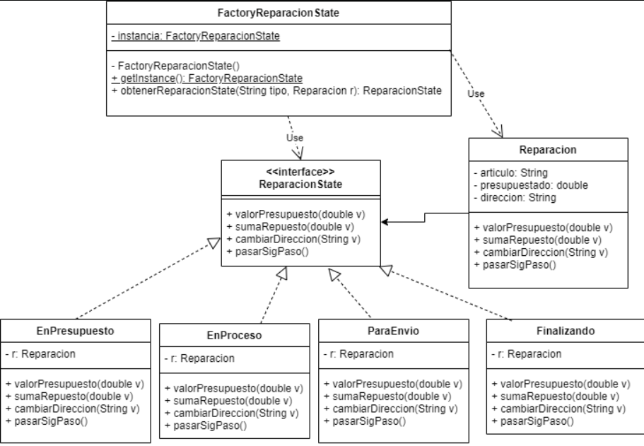

# Service técnico de reparaciones

Se desea modelar un service dedicado al seguimiento de la reparación de artículos
cuando ingresan a reparación. Teniendo las siguientes premisas:
Puede estar en alguno de los siguientes estados (solo uno a la vez):

1. En presupuesto.
2. En reparación.
3. Para envío.
4. Finalizado. 
   
Cada reparación tiene un nombre de artículo, un costo (o valor de presupuesto) y
una dirección de entrega.

Se le pueden dar los siguientes acciones:
- Cambiar dirección: darle una nueva dirección de entrega al cliente. 
- Dar valor del presupuesto: ingresar el valor básico del presupuesto.
- Agregar repuestos: sumar costos de repuestos al valor del presupuesto.
- Pasar al siguiente paso: cambiar de estado.

Los diferentes estados siguen el siguiente orden de secuencia y pueden conocer los
métodos que se indican:

Cada vez que cambia de estado debe mostrar el nombre del producto, estado,
presupuesto y dirección del envío. Hay que tener en cuenta que en el estado de
Presupuesto solamente permite ingresar el valor del presupuesto, en Reparacion
solo agregar valores de repuestos y en ParaEnvio solo cambiar la dirección. En
cualquier caso de llamar a un método no permitido en ese estado debe informar el
error.

Se debe hacer una clase (con correspondiente método main) que:

1. cree una reparación con un artículo “batidora”
2. le asigne un presupuesto
3. pase a reparación
4. se le agregue el importe de repuestos
5. pase a envío
6. se le cambie la dirección
7. pase a finalizado

# UML

