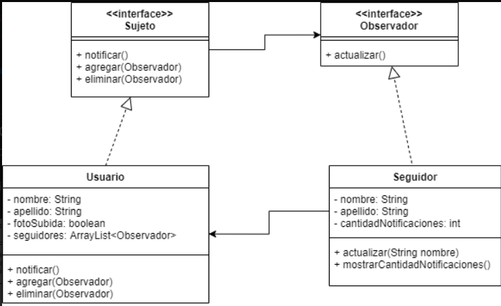

# Ejercicio

Se debe desarrollar un sistema de notificaciones para una red social que está por salir a producción. Existen usuarios y seguidores, ambos tienen nombre y apellido. Los usuarios, además, tienen un atributo que indica que han subido una foto. Tendrán que modelar un sistema que permita:
- A los usuarios poder agregar, eliminar y notificar a todos sus seguidores ante la subida de una foto.
- Ante la subida de una nueva foto por parte de un usuario deberá notificarse a todos los seguidores mostrándoles un mensaje por consola indicando que han sido notificados, por ejemplo, “Juan fue notificado de la foto que subió Jorge”.
- Los seguidores deben poder contabilizar la cantidad de notificaciones recibidas.

# UML 

