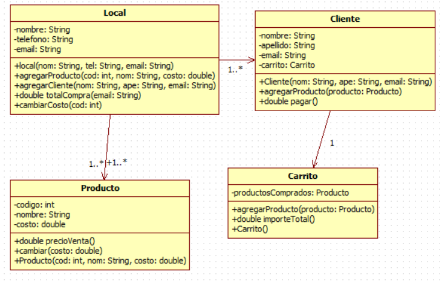

# Ejercicio
Un local de venta online posee productos para la venta. Este tiene un nombre de
fantasía, mail y teléfono de contacto. Los productos cuentan con un código, una
descripción y el costo de cada uno. El precio de venta se calcula aplicando un recargo
del 30% al costo del producto.

El local debe poder agregar productos a su catálogo de ofertas, así como también
cambiar el costo de dichos productos.

Los clientes seleccionan los productos que quieren adquirir mediante su código y los
agregan a su carrito de compras. Para efectuar la compra los clientes nos brindan su
nombre, apellido y un mail de contacto.

El local debe calcular el total de la compra de un cliente y mostrar un mensaje con el
resumen de la venta (datos del cliente, productos e importe total).

# UML

